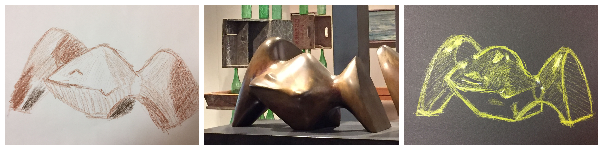
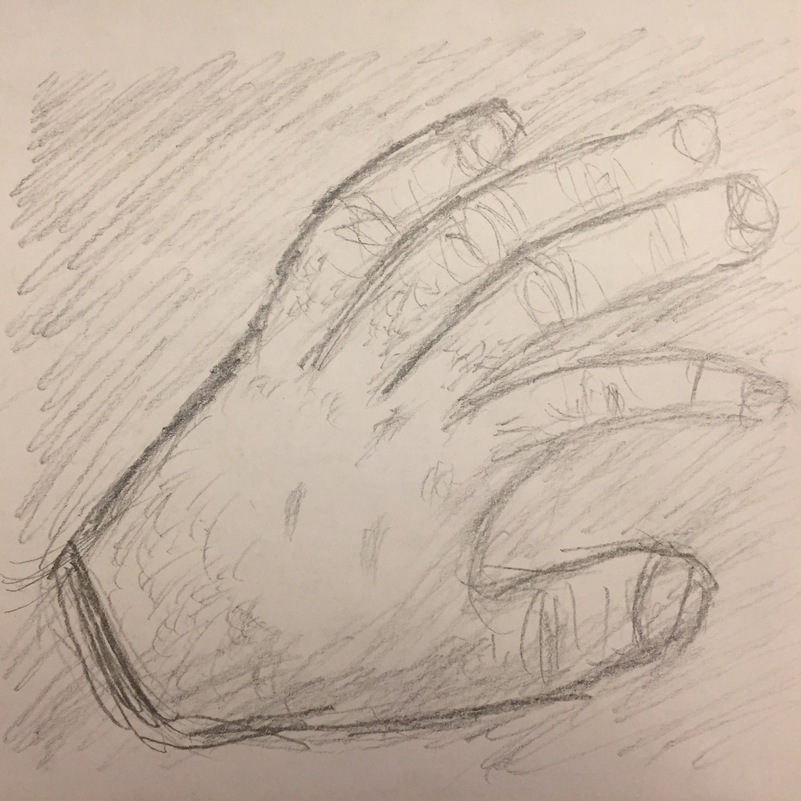
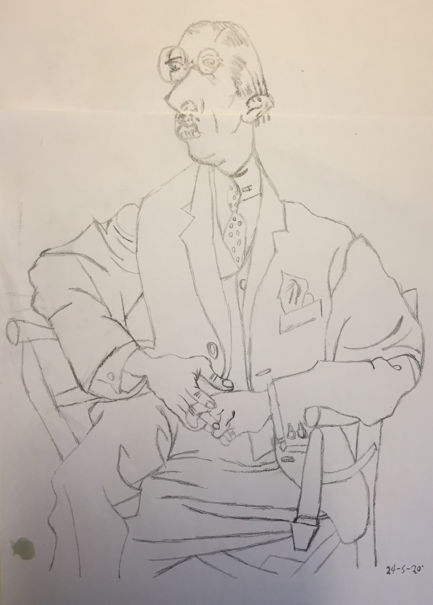
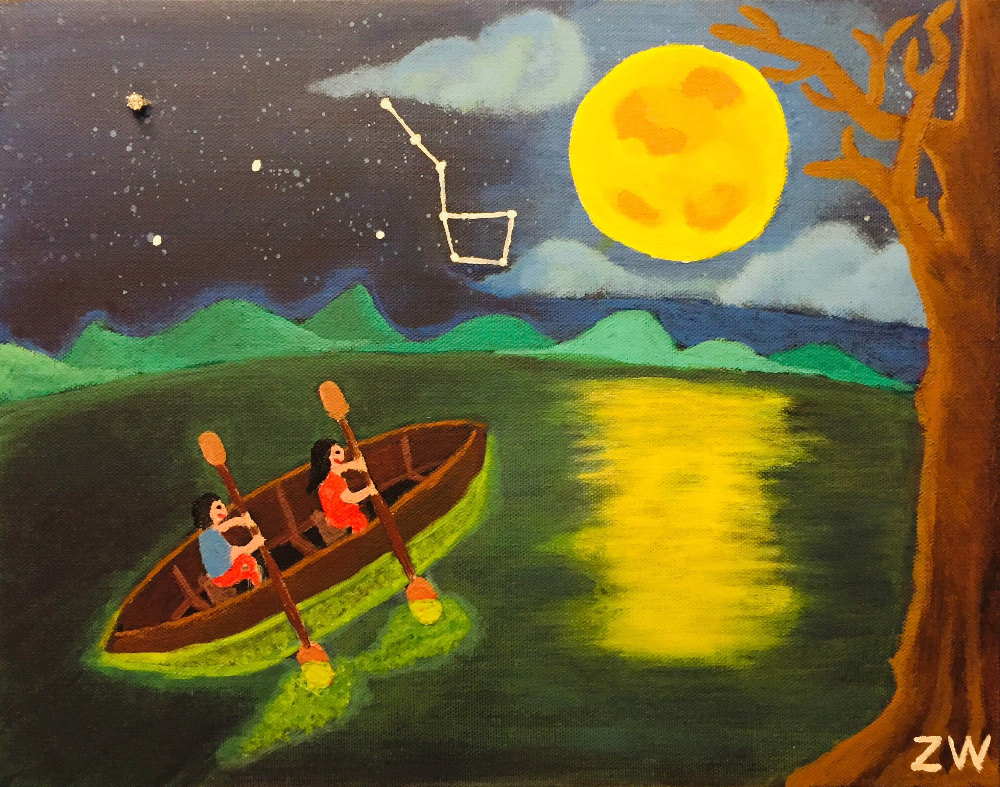
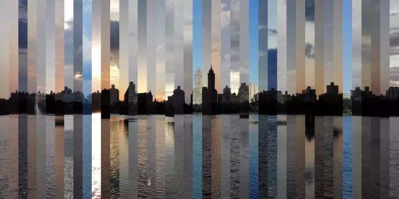

## Exhibitions
I have been fortunate to collaborate with Borou Yu, Jiajian Min, Tiange Zhou, and Benjamin Olsen on these interesting projects.
- [(Still) Life](http://tracer.cs.yale.edu:8087/)
- [The World of Freedom](https://mystudio.design/the-world-of-freedom-1)
- [Heritage Lost](https://mystudio.design/heritage-lost)
- [Bigelow Boilerworks](https://www.benjamindavidolsen.com/boilerworks-reconstructed)

## Drawing and painting

## Photography and videography

<video controls>
	<source src="assets/images/misc/eastrock.mp4" type="video/mp4">
</video>
