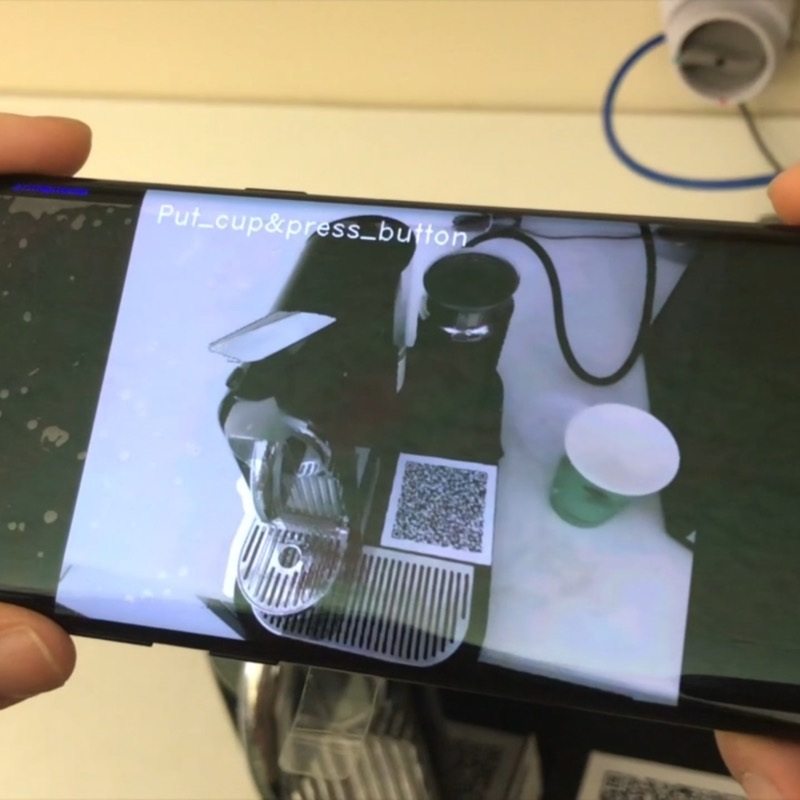

---
# Feel free to add content and custom Front Matter to this file.
# To modify the layout, see https://jekyllrb.com/docs/themes/#overriding-theme-defaults
title: Welcome
layout: page_no_title
---
<table style="border:0px">
<tr style="border:0px">
	<td style="border:0px; width:25%">
		
	</td>
	<td style="border:0px; text-align:justify; text-justify:inter-word;">
		I am an Assistant Professor of <a href="https://cma.hkust-gz.edu.cn/">Computational Media and Arts (CMA)</a> in the <a href="https://infh.hkust-gz.edu.cn/">Information Hub</a> at the <a href="https://hkust-gz.edu.cn/">Hong Kong University of Science and Technology (Guangzhou)</a> and an Affiliate Assistant Professor in the <a href="https://cse.hkust.edu.hk/">Department of Computer Science and Engineering</a> at the <a href="https://hkust.edu.hk/">Hong Kong University of Science and Technology</a>. I received a PhD from the <a href="http://cpsc.yale.edu/">Department of Computer Science</a> at <a href="https://www.yale.edu/">Yale University</a>, advised by Profs. <a href="https://graphics.cs.yale.edu/people/julie-dorsey">Julie Dorsey</a> and <a href="https://graphics.cs.yale.edu/people/holly-rushmeier">Holly Rushmeier</a>, and a BS from the <a href="https://www.cis.pku.edu.cn/">School of Artificial Intelligence</a> at <a href="http://www.pku.edu.cn/">Peking University</a>, advised by Profs. <a href="https://www.cis.pku.edu.cn/info/1084/1271.htm">Hongbin Zha</a> and <a href="https://www.microsoft.com/en-us/research/people/katsuike/">Katsushi Ikeuchi</a>.
	</td>
</tr>
<tr style="border:0px">
	<td style="border:0px; width:25%">
		<a href="http://www.zachzeyuwang.com:8000/CV-ZeyuWang-HKUST.pdf">[CV]</a> 
		<a href="mailto:zeyuwang [at] ust.hk">[Email]</a> 
		<a href="https://scholar.google.com/citations?user=q7NLPG0AAAAJ">[Google Scholar]</a> 
		<a href="https://www.researchgate.net/profile/Zeyu_Wang4">[ResearchGate]</a> 
		<a href="https://orcid.org/0000-0001-5374-6330">[ORCID]</a> 
		<a href="https://dblp.uni-trier.de/pid/132/7882-3.html">[DBLP]</a> 
		<a href="https://www.linkedin.com/in/zachzeyuwang">[LinkedIn]</a> 
		<a href="https://github.com/zachzeyuwang">[GitHub]</a> 
		<a href="https://twitter.com/zachzeyuwang">[Twitter]</a>
	</td>
	<td style="border:0px; text-align:justify; text-justify:inter-word;">
		I lead the Creative Intelligence and Synergy (CIS) Lab at HKUST(GZ) to study the intersection of Computer Graphics, Human-Computer Interaction, and Artificial Intelligence, with a focus on algorithms and systems for digital content creation. My current research topics include sketching, VR/AR/XR, generative techniques, and multimodality, with applications in art, design, perception, and cultural heritage. My research has been recognized by an <a href="https://research.adobe.com/fellowship/previous-fellowship-award-winners/">Adobe Research Fellowship</a>. I have multiple fully funded PhD, MPhil, PostDoc, and RA positions. Please drop me an email if you are interested in working with me. [<a href="https://zhuanlan.zhihu.com/p/570458778">招生</a>, <a href="https://cma.hkust-gz.edu.cn/admissions/">Admissions</a>]
	</td>
</tr>
</table>

## News
- 2022/10 &nbsp;&nbsp; Presented a [paper](/drawing-animation) at Pacific Graphics 2022.
- 2022/10 &nbsp;&nbsp; Gave a [talk](https://youtu.be/5Ycdb8O5ZWo) at KUIS AI Center. Thanks Prof. [Metin Sezgin](https://iui.ku.edu.tr/people/)!
- 2022/09 &nbsp;&nbsp; Gave an [invited talk](https://www.techbeat.net/talk-info?id=717) at TechBeat (in Chinese).
- 2022/09 &nbsp;&nbsp; Joined HKUST(GZ) as an Assistant Professor.

## Publications
<table style="border:0px">
<tr style="border:0px">
	<td style="border:0px">
		
	</td>
	<td style="border:0px">
		<b>Zeyu Wang</b>, Tuanfeng Y. Wang, Julie Dorsey 
		Learning a Style Space for Interactive Line Drawing Synthesis from Animated 3D Models 
		<i>Pacific Conference on Computer Graphics and Applications (PG)</i>, 2022 
		<a href="https://graphics.cs.yale.edu/sites/default/files/linedrawinganimation_pg2022.pdf">[pdf]</a>
		<a href="/drawing-animation">[project]</a>
		<a onclick="copyBibTeX(16)">[bibtex]</a>
	</td>
</tr>
<tr style="border:0px">
	<td style="border:0px">
		
	</td>
	<td style="border:0px">
		<b>Zeyu Wang</b>, Cuong Nguyen, Paul Asente, Julie Dorsey 
		Point Cloud Capture and Editing for AR Environmental Design 
		<i>ACM Symposium on User Interface Software and Technology (UIST) Demos</i>, 2022 
		<a href="http://www.zachzeyuwang.com:8000/papers/UISTdemo.pdf">[pdf]</a>
		<a onclick="copyBibTeX(15)">[bibtex]</a>
	</td>
</tr>
<tr style="border:0px">
	<td style="border:0px">
		
	</td>
	<td style="border:0px">
		Tiange Zhou, Borou Yu, Jiajian Min, <b>Zeyu Wang</b> 
		DAMUS: A Collaborative System for Choreography and Music Composition 
		<i>IEEE ICME Workshop on Artificial Intelligence for Art Creation (AIART)</i>, 2022 
		<a href="http://www.zachzeyuwang.com:8000/papers/DAMUS.pdf">[pdf]</a>
		<a onclick="copyBibTeX(14)">[bibtex]</a>
	</td>
</tr>
<tr style="border:0px">
	<td style="border:0px">
		
	</td>
	<td style="border:0px">
		<b>Zeyu Wang</b>, Sherry Qiu, Nicole Feng, Holly Rushmeier, Leonard McMillan, Julie Dorsey 
		Tracing Versus Freehand for Evaluating Computer-Generated Drawings 
		<i>ACM Transactions on Graphics (SIGGRAPH)</i>, 2021 
		<a href="https://graphics.cs.yale.edu/sites/default/files/tracing-vs-freehand_0.pdf">[pdf]</a>
		<a href="/tracing-vs-freehand">[project]</a>
		<a href="https://github.com/zachzeyuwang/tracing-vs-freehand">[dataset]</a>
		<a onclick="copyBibTeX(13)">[bibtex]</a>
		Invited Presentation at IEEE VIS 2021
	</td>
</tr>
<tr>
	<td style="border:0px">
		
	</td>
	<td style="border:0px">
		<b>Zeyu Wang</b>, Cuong Nguyen, Paul Asente, Julie Dorsey 
		DistanciAR: Authoring Site-Specific Augmented Reality Experiences for Remote Environments 
		<i>ACM CHI Conference on Human Factors in Computing Systems</i>, 2021 
		<a href="https://graphics.cs.yale.edu/sites/default/files/distanciar.pdf">[pdf]</a>
		<a href="/DistanciAR">[project]</a>
		<a onclick="copyBibTeX(12)">[bibtex]</a>
	</td>
</tr>
<tr>
	<td style="border:0px">
		
	</td>
	<td style="border:0px">
		Weiqi Shi, <b>Zeyu Wang</b>, Cyril Soler, Holly Rushmeier 
		A Low-Dimensional Perceptual Space for Intuitive BRDF Editing 
		<i>Eurographics Symposium on Rendering (EGSR)</i>, 2021 
		<a href="https://graphics.cs.yale.edu/sites/default/files/paper1006_preprint.pdf">[pdf]</a>
		<a onclick="copyBibTeX(11)">[bibtex]</a>
	</td>
</tr>
<tr>
	<td style="border:0px">
		
	</td>
	<td style="border:0px">
		Yifen Shen, <b>Zeyu Wang</b>, Qinying Sun, Anne Chen, Holly Rushmeier 
		Reconstructing Dura-Europos From Sparse Photo Collections Using Deep Contour Extraction 
		<i>Eurographics Workshop on Graphics and Cultural Heritage (EG GCH)</i>, 2021 
		<a href="https://graphics.cs.yale.edu/sites/default/files/gch2021_crc_1.pdf">[pdf]</a>
		<a href="https://youtu.be/rgDLIA-Wz4M">[video]</a>
		<a href="https://tracer.cs.yale.edu:8887/">[interface]</a>
		<a onclick="copyBibTeX(10)">[bibtex]</a>
	</td>
</tr>
<tr>
	<td style="border:0px">
		
	</td>
	<td style="border:0px">
		Davit Gigilashvili, Weiqi Shi, <b>Zeyu Wang</b>, Marius Pedersen, Jon Yngve Hardeberg, Holly Rushmeier 
		The Role of Subsurface Scattering in Glossiness Perception 
		<i>ACM Transactions on Applied Perception (TAP)</i>, 2021 
		<a href="https://graphics.cs.yale.edu/sites/default/files/mainsupplementary.pdf">[pdf]</a>
		<a onclick="copyBibTeX(9)">[bibtex]</a>
	</td>
</tr>
<tr style="border:0px">
	<td style="border:0px">
		
	</td>
	<td style="border:0px">
		<b>Zeyu Wang</b>*, Shiyu Qiu*, Qingyang Chen, Natallia Trayan, Alexander Ringlein, Julie Dorsey, Holly Rushmeier 
		AniCode: Authoring Coded Artifacts for Network-Free Personalized Animations 
		<i>The Visual Computer</i>, 2019 
		<a href="https://graphics.cs.yale.edu/sites/default/files/wang2019_article_anicodeauthoringcodedartifacts.pdf">[pdf]</a>
		<a href="https://youtu.be/qqzOLu47alw">[video]</a>
		<a href="http://tracer.cs.yale.edu/AniCode.html">[demo]</a>
		<a href="https://github.com/zachzeyuwang/AniCode">[code]</a>
		<a onclick="copyBibTeX(8)">[bibtex]</a>
	</td>
</tr>
<tr style="border:0px">
	<td style="border:0px">
		
	</td>
	<td style="border:0px">
		<b>Zeyu Wang</b>, Weiqi Shi, Kiraz Akoglu, Eleni Kotoula, Ying Yang, Holly Rushmeier 
		CHER-Ob: A Tool for Shared Analysis and Video Dissemination 
		<i>ACM Journal on Computing and Cultural Heritage (JOCCH)</i>, 2018 
		<a href="https://graphics.cs.yale.edu/sites/default/files/a18-wang.pdf">[pdf]</a>
		<a href="https://graphics.cs.yale.edu/software-packages/cher-ob-open-source-platform-shared-analysis-and-video-dissemination-cultural">[project]</a>
		<a href="https://github.com/WeiqiJust/CHER-Ob">[code]</a>
		<a onclick="copyBibTeX(7)">[bibtex]</a>
	</td>
</tr>
<tr style="border:0px">
	<td style="border:0px">
		
	</td>
	<td style="border:0px">
		<b>Zeyu Wang</b>, Kiraz Akoglu, Holly Rushmeier 
		An Introductory Video Generator for Disseminating Cultural Heritage Projects 
		<i>Eurographics Workshop on Graphics and Cultural Heritage (EG GCH)</i>, 2017 
		<a href="https://graphics.cs.yale.edu/sites/default/files/video_generator_0.pdf">[pdf]</a>
		<a onclick="copyBibTeX(6)">[bibtex]</a>
		Best Paper Award
	</td>
</tr>
<tr style="border:0px">
	<td style="border:0px">
		
	</td>
	<td style="border:0px">
		Weiqi Shi, <b>Zeyu Wang</b>, Metin Sezgin, Julie Dorsey, Holly Rushmeier 
		Material Design in Augmented Reality with In-Situ Visual Feedback 
		<i>Eurographics Symposium on Rendering (EGSR)</i>, 2017 
		<a href="https://graphics.cs.yale.edu/sites/default/files/paper1051_final.pdf">[pdf]</a>
		<a onclick="copyBibTeX(5)">[bibtex]</a>
	</td>
</tr>
<tr style="border:0px">
	<td style="border:0px">
		
	</td>
	<td style="border:0px">
		<b>Zeyu Wang</b>, Xiaohan Jin, Dian Shao, Renju Li, Hongbin Zha, Katsushi Ikeuchi 
		Digital Longmen Project: A Free Walking VR System with Image-Based Restoration 
		<i>Asian Conference on Computer Vision (ACCV) Workshop on e-Heritage</i>, 2016 
		<a href="http://www.zachzeyuwang.com:8000/papers/Longmen.pdf">[pdf]</a>
		<a href="https://youtu.be/x_hPkkbz0o0">[seminar]</a>
		<a href="https://youtu.be/zbYUtkQ9vQ4">[video]</a>
		<a onclick="copyBibTeX(4)">[bibtex]</a>
	</td>
</tr>
<tr style="border:0px">
	<td style="border:0px">
		
	</td>
	<td style="border:0px">
		<b>Zeyu Wang</b>, Xiaohan Jin, Fei Xue, Renju Li, Hongbin Zha, Katsushi Ikeuchi 
		Perceptual Enhancement for Stereoscopic Videos Based on Horopter Consistency 
		<i>ACM Conference on Virtual Reality Software and Technology (VRST)</i>, 2016 
		<a href="http://www.zachzeyuwang.com:8000/papers/Horopter.pdf">[pdf]</a>
		<a href="https://youtu.be/EMN9zlDqXlM">[video]</a>
		<a onclick="copyBibTeX(3)">[bibtex]</a>
	</td>
</tr>
<tr style="border:0px">
	<td style="border:0px">
		
	</td>
	<td style="border:0px">
		<b>Zeyu Wang</b>, James K. Min, Guanglei Xiong 
		Robotics-Driven Printing of Curved 3D Structures for Manufacturing Cardiac Therapeutic Devices 
		<i>IEEE International Conference on Robotics and Biomimetics (ROBIO)</i>, 2015 
		<a href="http://www.zachzeyuwang.com:8000/papers/Robotics.pdf">[pdf]</a>
		<a href="https://youtu.be/JEqd8QHtf0Q">[video]</a>
		<a onclick="copyBibTeX(2)">[bibtex]</a>
	</td>
</tr>
<tr style="border:0px">
	<td style="border:0px">
		
	</td>
	<td style="border:0px">
		<b>Zeyu Wang</b>, Xiaohan Jin, Fei Xue, Xin He, Renju Li, Hongbin Zha 
		Panorama to Cube: A Content-Aware Representation Method 
		<i>ACM SIGGRAPH Asia Technical Briefs</i>, 2015 
		<a href="http://www.zachzeyuwang.com:8000/papers/Panorama2Cube.pdf">[pdf]</a>
		<a href="https://youtu.be/wJy2ZAhunP0">[video]</a>
		<a href="https://github.com/zachzeyuwang/Panorama-to-Cube">[code]</a>
		<a onclick="copyBibTeX(1)">[bibtex]</a>
	</td>
</tr>
</table>

BibTeX copied to clipboard




